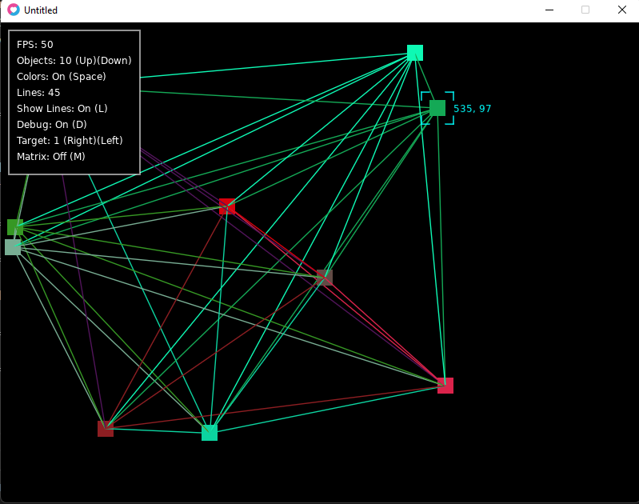

# love2d-network-simulation
Fun experiment with simulating a network graph with physics using love2d.

# Install
- Install [LÖVE](https://love2d.org/)
- `cd` to directory
- Run `love .`

# Screenshot

